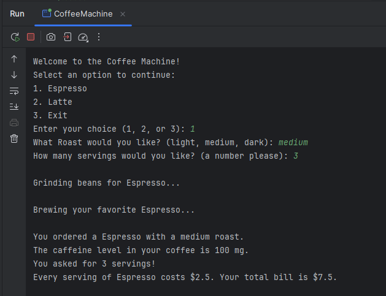

# ☕ Coffee Machine Java Program

This Java project simulates a basic **Coffee Machine** that allows users to order and customize two types of coffee: **Espresso** and **Latte**. It showcases **Object-Oriented Programming (OOP)** principles by using **inheritance**, **attributes**, **methods**, and **superclasses** to model coffee drinks as real-world objects.

---

## 📌 Project Description

The Coffee Machine presents a menu with three options:

1. **Espresso** – User selects roast and number of servings.
2. **Latte** – User selects roast, milk type, and optional syrup flavor.
3. **Exit** – Terminates the program.

The coffee selections are implemented through Java classes that reflect real-world characteristics of coffee. Each drink class extends a **superclass** and inherits shared behaviors while defining specific details for each drink type.

---

## 🧠 OOP Concepts Practiced

This project reinforces foundational OOP principles:

- **Inheritance**:  
  `Espresso` and `Latte` classes inherit from a common superclass, likely `Coffee`, allowing shared code to be reused (e.g., `grindBeans()`, `brewCoffee()`).

- **Attributes**:  
  Each class defines attributes specific to the coffee type, such as `roast`, `milkType`, `syrupFlavor`, and `numberOfShots`.

- **Methods**:  
  Methods like `printInfo()`, `grindBeans()`, and `brewCoffee()` demonstrate behavior encapsulated in each class.

- **Superclasses and Subclasses**:  
  A `Coffee` superclass contains general properties and methods, while `Espresso` and `Latte` subclasses extend it to add their own unique functionality.

---

## 📂 Project Structure

coffee-machine/
- CoffeeMachineMain.java  (Main program with user interaction logic)
- Coffee.java  (Superclass for shared coffee attributes/methods)
- Espresso.java  (Subclass representing an Espresso)
- Latte.java  (Subclass representing a Latte)

## 🚀 How to Run

1. Clone the repository or copy the files locally.
2. Open in IntelliJ IDEA or your preferred Java IDE.
3. Compile the program:
   ```bash
   CoffeeMachine.java
4. Run program:  CoffeeMachine.java
5. Follow the interactive prompts in the terminal
   
## 💡 Example Interactions




## ‍💻 Author

Developed by Erica Brooks as part of practice for the Amazon Junior Software Developer Certificate on Coursera.

## 📬 Feedback & Contributions

This repository is a work-in-progress learning portfolio. Suggestions, corrections, and ideas are always welcome — feel free to open an issue or pull request.
